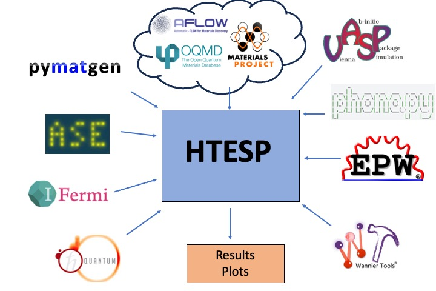

.. HTESP documentation master file, created by
   sphinx-quickstart on Sun Feb 11 09:33:42 2024.
   You can adapt this file completely to your liking, but it should at least
   contain the root `toctree` directive.

Welcome to HTESP's documentation!
=================================

Introducing HTESP, the High Throughput Electronic Structure Package, designed for Quantum Espresso (QE) and VASP simulations. HTESP streamlines input file preparation from the Materials Project, OQMD, and AFLOW databases and offers a wide range of functionalities, from basic ground-state calculations to advanced electron-phonon studies and superconductivity analyses. With seamless integration with QE and VASP, HTESP empowers researchers to explore complex material landscapes, automate calculations, and investigate material electronic structures efficiently.

To Do ......

 1. Finish Documentation (Tutorial in progress ..........). Add comments to python scripts.

 2. Check all the capability of the code with calculations (prepare tutorials in separate folders)

 3. Show basic statistics, by elements, spacegroup,

 4. Include fermisurfer?

 

* :ref:`search`

Installation
-------------

.. toctree::

   usage

Inputs and Parameters
----------------------

.. toctree::

   param

Inputs other than htepc.json
-----------------------------

.. toctree::

   otherinput

Command-line interface
-----------------------

.. toctree::

   command

Tutorials
------------

.. toctree::

   tutorial

License
---------

.. toctree::

   license

Contribution
------------

.. toctree::

   contrib

Cite
-------

.. toctree::

   cite

API Documentation
------------------

.. toctree::
   :maxdepth: 1

   utils
