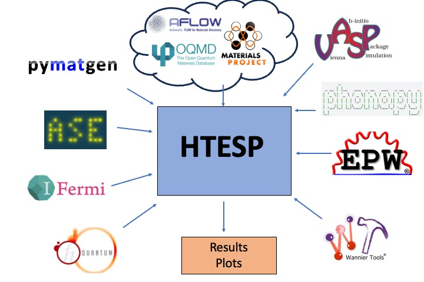

.. HTESP documentation master file.
   You can adapt this file completely to your liking, but it should at least
   contain the root `toctree` directive.

Welcome to HTESP's documentation!
=================================

HTESP, the High Throughput Electronic Structure Package, drives Quantum ESPRESSO
(QE) and VASP calculations on a SLURM cluster.  It prepares input files from the
Materials Project, OQMD and AFLOW databases, and covers everything from
ground-state relaxation to electron-phonon coupling, superconducting Tc,
wannierisation, elastic constants, phase diagrams and Fermi surfaces.

Start with :doc:`usage` to install it, then :doc:`tutorial` for the campaigns and
:doc:`examples` for the 42 worked examples that ship with the package.

* :ref:`search`

Installation
-------------

.. toctree::

   usage

Inputs and Parameters
----------------------

.. toctree::

   param

Inputs other than config.json
-----------------------------

.. toctree::

   otherinput

Command-line interface
-----------------------

.. toctree::

   command

Tutorials
------------

.. toctree::

   tutorial

Worked examples
----------------

.. toctree::

   examples

Parallelism and the workflow layer
-----------------------------------

.. toctree::

   workflow

Running the tutorials end to end
---------------------------------

.. toctree::

   tutorial_runner

Testing and contributing
-------------------------

.. toctree::

   testing

License
---------

.. toctree::

   license

Contribution
------------

.. toctree::

   contrib

Cite
-------

.. toctree::

   cite

API Documentation
------------------

.. toctree::
   :maxdepth: 1

   utils
